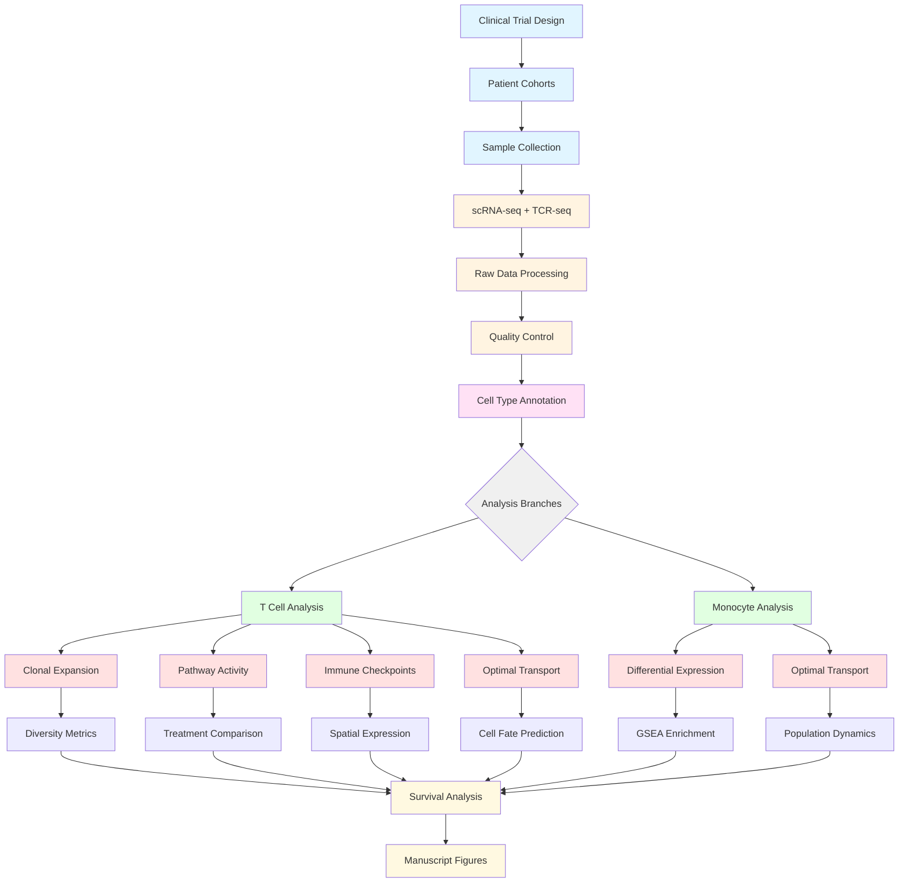

# Analysis Workflow Diagram

## Overall Study Design and Computational Pipeline



## Detailed Step-by-Step Pipeline

### 🧪 Phase 1: Clinical Trial & Data Collection
```
┌─────────────────────────────────────────────────────────────┐
│ Clinical Trial Design                                        │
│   • Glioblastoma patients                                    │
│   • Treatment: MK-3475 (anti-PD-1) ± MLA                    │
│   • Timepoints: Pre, C1, C2, C4, C6, C9, C18, C36          │
│   • Cohorts: Control vs Experimental                         │
└─────────────────────────────────────────────────────────────┘
                           ↓
┌─────────────────────────────────────────────────────────────┐
│ Sample Collection & Processing                               │
│   • Peripheral blood mononuclear cells (PBMCs)              │
│   • Single-cell RNA sequencing (10X Genomics)               │
│   • TCR VDJ sequencing (β chain)                            │
└─────────────────────────────────────────────────────────────┘
```

### 📊 Phase 2: Data Processing & QC
```
┌─────────────────────────────────────────────────────────────┐
│ Seurat Pipeline (R)                 [Scripts: Annotation/]  │
│   • Read 10X data → Create Seurat object                    │
│   • Quality control filtering                                │
│   • Normalization & scaling                                  │
│   • PCA → UMAP dimensionality reduction                     │
│   • Clustering (multiple resolutions tested)                │
└─────────────────────────────────────────────────────────────┘
                           ↓
┌─────────────────────────────────────────────────────────────┐
│ Cell Type Annotation                [Script: annotation.R]  │
│   • Marker gene expression                                   │
│   • Manual annotation based on canonical markers            │
│   • T cells, Monocytes, DCs, NK cells identified           │
│                                                              │
│   Outputs: Figure 5a (All cells), Figure 6a (T cells)      │
└─────────────────────────────────────────────────────────────┘
```

### 🔬 Phase 3A: T Cell Analysis Pipeline
```
┌─────────────────────────────────────────────────────────────┐
│ Clonal Expansion Analysis    [Scripts: clonal_expansion_*]  │
│                                                              │
│   Step 1: Prepare clonotype tables                          │
│           [clonal_expansion_analysis_1.R]                    │
│           - Map cell barcodes to TCR CDR3β sequences        │
│           - Generate count & proportion tables               │
│                                                              │
│   Step 2: Calculate diversity indices                        │
│           [diversity_calculation_2.R]                        │
│           - Shannon & Simpson diversity per sample           │
│                                                              │
│   Step 3: Calculate expansion metrics                        │
│           [clonal_expansion_calculation_3.R]                 │
│           - Compare timepoints (C1 vs Pre, C2 vs C1)        │
│                                                              │
│   Step 4: Visualize results                                  │
│           [clonal_expansion_plots_4.R]                       │
│           - Line plots, boxplots, statistical tests          │
│                                                              │
│   Output: Figure 6d                                          │
└─────────────────────────────────────────────────────────────┘
                           ↓
┌─────────────────────────────────────────────────────────────┐
│ Pathway Activity Analysis [Script: pathway_activity_*]      │
│   • Calculate pathway scores (mean gene expression)          │
│   • Weight by cluster proportions                            │
│   • Compare treatment arms (MK-3475 vs MK-3475+MLA)         │
│   • Statistical testing (Wilcoxon)                           │
│                                                              │
│   Outputs: Figure 6b (trajectories), Figure 6c (boxplots)  │
└─────────────────────────────────────────────────────────────┘
                           ↓
┌─────────────────────────────────────────────────────────────┐
│ Optimal Transport - T Cells  [Scripts: optimal_transport.*] │
│                                                              │
│   Part A: Data preparation (R)                               │
│           [optimal_transport.R]                              │
│           - Extract clone-enriched cells                     │
│           - Generate source/target CSV files                 │
│                                                              │
│   Part B: Transport analysis (Python)                        │
│           [t_cell_optimal_transport.ipynb]                   │
│           - Compute Earth Mover's Distance                   │
│           - Generate movement arrows                         │
│           - Analyze fate transitions                         │
│                                                              │
│   Part C: Central Memory CD8 focus                          │
│           [central_memory_cd8_t_cell_optimal_transport.ipynb]│
│                                                              │
│   Outputs: Figure 7a (clone tracking)                       │
│            Figure 7b (cluster arrows)                        │
│            Figure 8a (fate distributions)                    │
│            Figure 8b (Central Memory fates)                 │
└─────────────────────────────────────────────────────────────┘
                           ↓
┌─────────────────────────────────────────────────────────────┐
│ Immune Checkpoint Analysis [Script: immune_checkpoint_*]    │
│   • Expression of 21 checkpoint genes                        │
│   • Spatial patterns in UMAP                                 │
│   • Temporal dynamics (Pre, C1, C2)                         │
│   • Cohort stratification                                    │
│                                                              │
│   Output: Figure 8c (density plots)                         │
└─────────────────────────────────────────────────────────────┘
```

### 🔬 Phase 3B: Monocyte Analysis Pipeline
```
┌─────────────────────────────────────────────────────────────┐
│ Non-Classical Monocyte Analysis                              │
│                                                              │
│   Step 1: Optimal transport (Python)                         │
│           [NC_Monocyte_Optimal_Transport.ipynb]              │
│           - Population shifts Pre → C1                       │
│           - Predecessor mapping                              │
│           Output: Figure 5b                                  │
│                                                              │
│   Step 2: Differential expression (R)                        │
│           [nc_monocytes_analysis.R]                          │
│           - Compare C1 vs Pre predecessors                   │
│           - Pseudo-bulk RNA-seq (edgeR)                      │
│           - Hierarchical clustering                          │
│           - GSEA pathway enrichment                          │
│           - Cox survival analysis                            │
│           Outputs: Figure 5c (heatmap)                       │
│                    Figure 5e (GSEA)                          │
│                    Figure 5f (survival)                      │
│                                                              │
│   Step 3: Chemotaxis analysis                                │
│           [UMAP_comparisons.R]                               │
│           - Gene expression Pre vs C1                        │
│           Output: Figure 5d                                  │
└─────────────────────────────────────────────────────────────┘
```

### 📈 Phase 4: Statistical Analysis & Comparisons
```
┌─────────────────────────────────────────────────────────────┐
│ Cluster Proportion Analysis [Script: cluster_proportion_*]  │
│   • Major cell types (5 populations)                         │
│   • T cell subpopulations (13 subsets)                      │
│   • Treatment arm comparison                                 │
│   • Temporal dynamics                                        │
│                                                              │
│   Outputs: Supplemental Table S3 (major cells)              │
│            Supplemental Table S4 (T cells)                   │
└─────────────────────────────────────────────────────────────┘
                           ↓
┌─────────────────────────────────────────────────────────────┐
│ Survival Analysis Integration                                │
│   • Cox proportional hazards models                          │
│   • Pathway activity correlations                            │
│   • Cohort stratification:                                   │
│     - Control (NLS+PEM)                                      │
│     - Short-term survivors (LTT+PEM < median OS)            │
│     - Long-term survivors (LTT+PEM > median OS)             │
└─────────────────────────────────────────────────────────────┘
```

### 📊 Phase 5: Visualization & Manuscript Generation
```
┌─────────────────────────────────────────────────────────────┐
│ Final Outputs                                                │
│                                                              │
│   Main Figures:                                              │
│   • Figure 5: Monocyte analysis (5a-f)                      │
│   • Figure 6: T cell analysis (6a-d)                        │
│   • Figure 7: Clone tracking & OT (7a-b)                    │
│   • Figure 8: Cell fate & checkpoints (8a-c)               │
│                                                              │
│   Supplemental Tables:                                       │
│   • Table S3: Major cell type proportions                    │
│   • Table S4: T cell subpopulation proportions              │
│                                                              │
│   See: FIGURE_TO_SCRIPT_MAPPING.txt                         │
└─────────────────────────────────────────────────────────────┘
```

## Software Stack

```
┌─────────────────────────┐     ┌─────────────────────────┐
│   R Analysis            │     │   Python Analysis       │
│   ================      │     │   ================      │
│   • Seurat (4.3.0)     │     │   • scanpy (1.8.0+)    │
│   • dplyr/tidyr        │     │   • anndata (0.8.0+)   │
│   • ggplot2/cowplot    │     │   • POT (0.8.0+)       │
│   • edgeR (3.36.0+)    │     │   • numpy/pandas       │
│   • survival           │     │   • matplotlib/seaborn │
└─────────────────────────┘     └─────────────────────────┘
```

## Data Flow

```
Raw Data (EGA) → Seurat Objects → Analysis Scripts → Figures/Tables
                                        ↓
                               CSV Exports for Python
                                        ↓
                          Jupyter Notebooks (OT analysis)
                                        ↓
                               Final Visualizations
```

## Quick Navigation by Figure

| Figure | Primary Script | Analysis Type |
|--------|----------------|---------------|
| 5a | annotation.R | Cell type UMAP |
| 5b | NC_Monocyte_Optimal_Transport.ipynb | Optimal transport |
| 5c | nc_monocytes_analysis.R | DE heatmap |
| 5d | UMAP_comparisons.R | Chemotaxis genes |
| 5e | nc_monocytes_analysis.R | GSEA pathways |
| 5f | nc_monocytes_analysis.R | Cox survival |
| 6a | annotation.R | T cell UMAP |
| 6b | pathway_activity_comparison_new.R | Pathway trajectories |
| 6c | pathway_activity_comparison_new.R | Pathway boxplots |
| 6d | clonal_expansion_plots_4.R | Clonal expansion |
| 7a | track_t_cell_subpopulation_clones.R | Clone tracking |
| 7b | t_cell_optimal_transport.ipynb | Cluster movement |
| 8a | t_cell_optimal_transport.ipynb | Fate distributions |
| 8b | central_memory_cd8_t_cell_optimal_transport.ipynb | CM CD8 fates |
| 8c | immune_checkpoint_comparison.R | Checkpoint density |

---

**Total Runtime:** ~10-15 hours on high-performance workstation (16-core, 64GB RAM)
**Required Storage:** ~100 GB free disk space